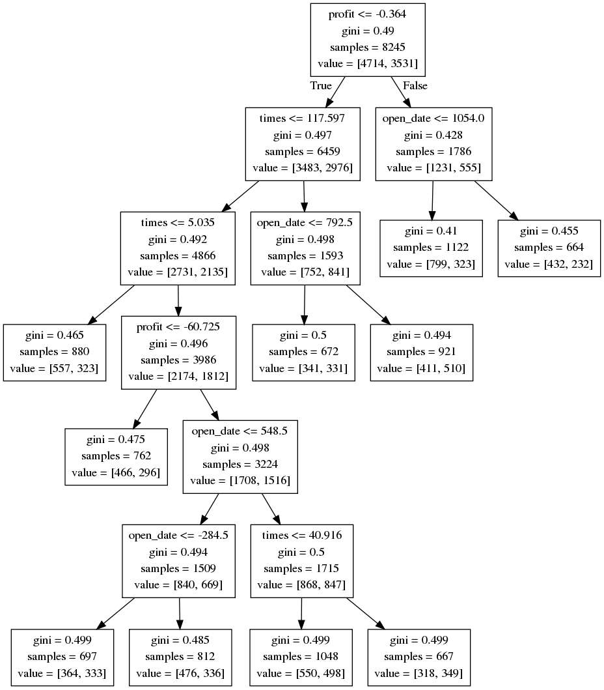
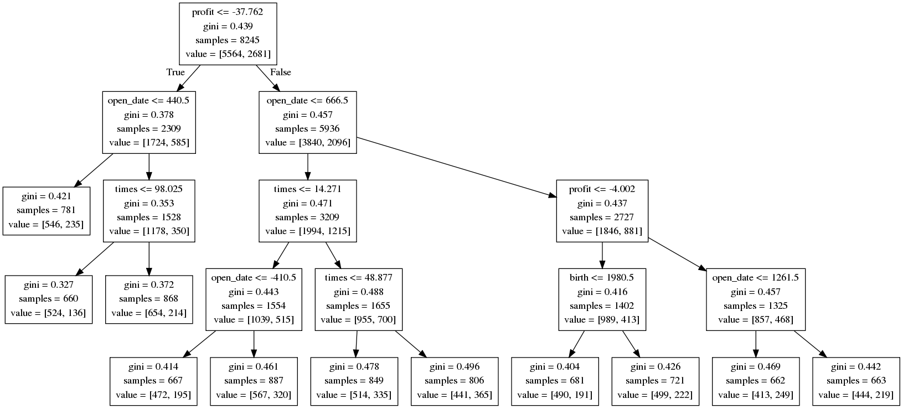

# 期货投资者类型（momentum or reverse）分析

## How to determine the type of trader ?

使用softmax回归，自变量为T-1天到T天的合约价格变化情况，因变量为T天到T+1天该投资者在该合约上持仓量的变化情况。

| 结算价变化 | 变量   |
| ----- | ---- |
| 上涨    | +1   |
| 持平    | 0    |
| 下跌    | -1   |

| 持仓量变化    | 行为类型 | 变量   |
| -------- | ---- | ---- |
| 买持仓增加    | 看涨   | 1    |
| 买持仓减少    | 看跌   | -1   |
| 卖持仓增加    | 看跌   | -1   |
| 卖持仓减少    | 看涨   | 1    |
| 持仓，但持仓不变 | 观望   | 0    |

若$P(Y=1|X=1)>P(Y=-1|X=1)\ 且\ P(Y=-1|X=-1)>P(Y=1|X=-1)$，则该交易者为动量型（momentum）；反之，为逆向型（reverse）。

除了softmax估计概率外，还可以使用朴素贝叶斯拟合数据并估计概率。

**使用更长时间的价格变化回归。**

**根据投资品种波动率确定人的风险偏好**


## How to analyse the type of trader ?

### Logit Regression

使用以下特征作为解释变量，分别回归投资者是否为动量型以及是否为逆向型。

1. 出生年
2. 开户日到2012年1月1日之间间隔的天数
3. 是否为北京、上海的投资者
4. 是否为河南本地的投资者
5. 三年的月平均交易次数  （晚间交易次数、交易商品期货次数等可作为扩充）
6. 三年的月平均收益（百元，扣除手续费）


```
                               是否为动量型投资者
==============================================================================
Dep. Variable:               momentum   No. Observations:                 8245
Model:                        MNLogit   Df Residuals:                     8238
Method:                           MLE   Df Model:                            6
Date:                Thu, 18 Jan 2018   Pseudo R-squ.:                0.003279
Time:                        18:47:59   Log-Likelihood:                -5611.4
converged:                       True   LL-Null:                       -5629.8
                                        LLR p-value:                 1.827e-06
================================================================================
  momentum=1       coef    std err          z      P>|z|      [0.025      0.975]
--------------------------------------------------------------------------------
birth        -6.099e-05      0.000     -0.228      0.820      -0.001       0.000
open_date        0.0001   2.34e-05      5.037      0.000    7.19e-05       0.000
times         2.587e-05   3.34e-05      0.774      0.439   -3.96e-05    9.14e-05
profit          -0.0001   7.33e-05     -1.854      0.064      -0.000    7.76e-06
北京上海         -0.3142      0.161     -1.954      0.051      -0.629       0.001
河南             0.0349      0.050      0.700      0.484      -0.063       0.133
intercept       -0.2388      0.530     -0.451      0.652      -1.278       0.800
================================================================================
```

```
                               是否为逆向型投资者
==============================================================================
Dep. Variable:                reverse   No. Observations:                 8245
Model:                        MNLogit   Df Residuals:                     8238
Method:                           MLE   Df Model:                            6
Date:                Thu, 18 Jan 2018   Pseudo R-squ.:                0.004975
Time:                        18:47:59   Log-Likelihood:                -5174.3
converged:                       True   LL-Null:                       -5200.1
                                        LLR p-value:                 2.105e-09
================================================================================
   reverse=1       coef    std err          z      P>|z|      [0.025      0.975]
--------------------------------------------------------------------------------
birth         1.799e-05      0.000      0.070      0.944      -0.000       0.001
open_date       -0.0001   2.42e-05     -4.974      0.000      -0.000   -7.29e-05
times         7.506e-06   3.46e-05      0.217      0.828   -6.04e-05    7.54e-05
profit           0.0003   8.84e-05      3.625      0.000       0.000       0.000
北京上海          0.4551      0.154      2.946      0.003       0.152       0.758
河南             0.0250      0.053      0.474      0.636      -0.078       0.128
intercept       -0.7157      0.509     -1.407      0.159      -1.712       0.281
================================================================================
```


### Decision Tree

使用同样的特征，分别以是否为动量型和是否为逆向型作为标签，建立决策树。



​                                                  图1. 区分是否为动量型的决策树




​                                                   图2. 区分是否为逆向型的决策树